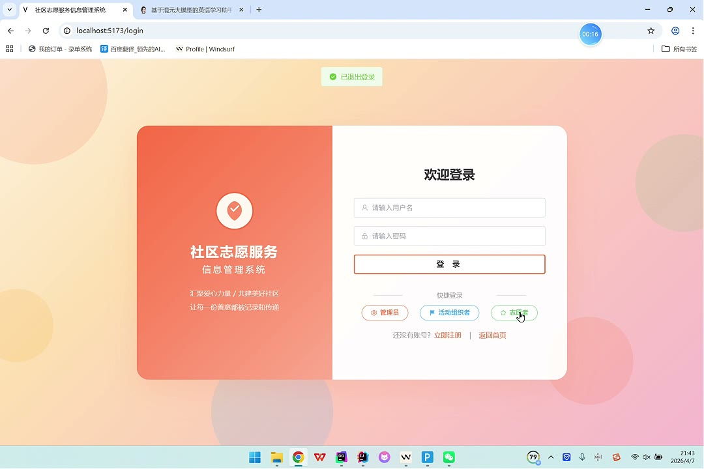
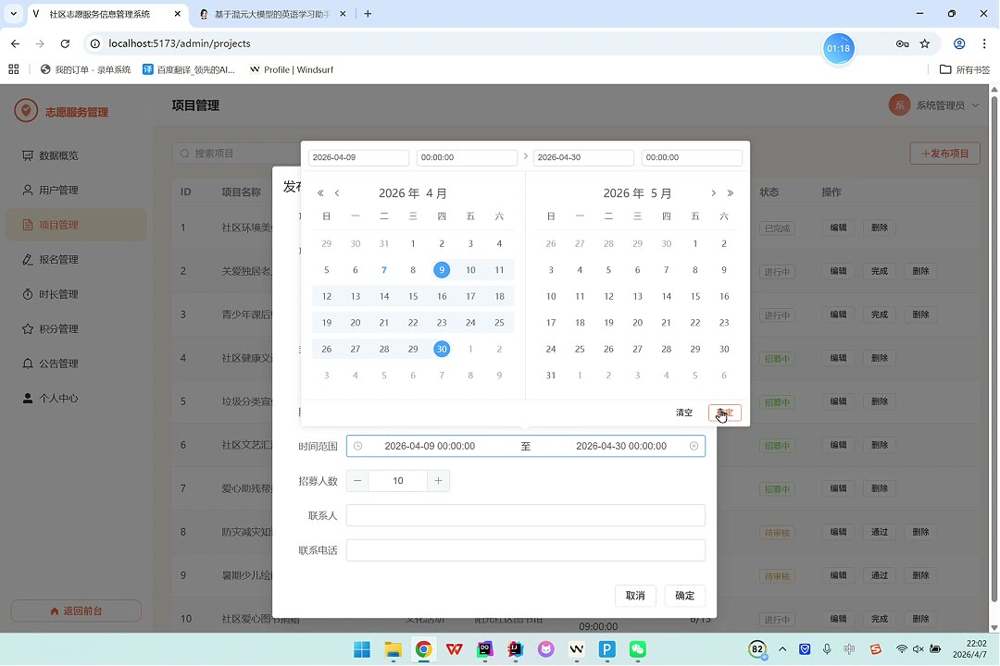
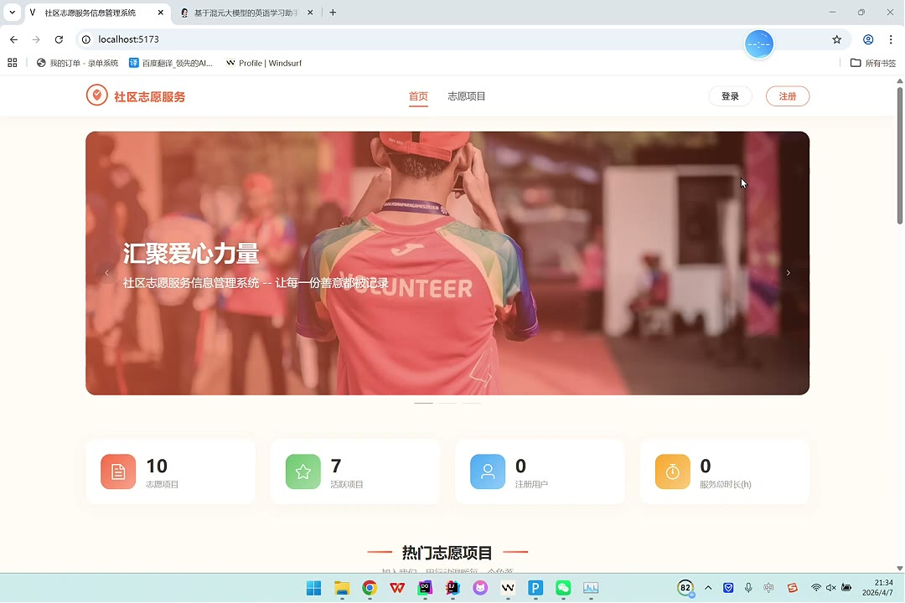
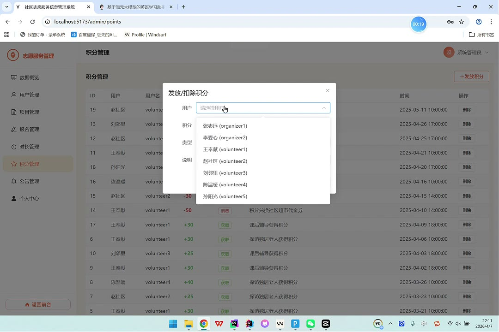
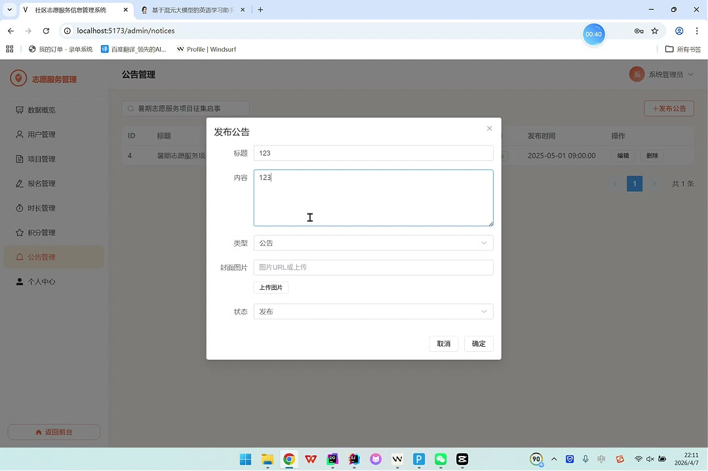

# (附文档)Springboot3+Vue3+MySQL 社区志愿服务信息管理系统

**技术栈**：Springboot3、Vue3、MySQL

### 系统简介

本系统是一套基于 Spring Boot 3 + Vue 3 前后端分离架构的社区志愿服务信息管理平台，支持管理员、活动组织者、志愿者三种角色协同工作。系统提供志愿服务项目管理、报名审核、服务时长记录、积分体系、公告发布、数据统计看板等功能，帮助社区高效组织志愿活动并量化志愿者的服务贡献。
 
### 核心功能
 
### 普通用户端

 
- 浏览公开的志愿服务项目列表（支持按分类、关键词搜索，分页展示） 
- 查看单个项目的详细信息（标题、描述、分类、地点、时间、联系人、当前报名人数等） 
- 查看已发布的公告列表（仅显示状态为已发布的公告，按时间倒序排列） 
- 查看系统公开统计数据（项目总数、活跃项目数） 
- 注册新账号（选择身份为活动组织者或志愿者，填写用户名、密码、真实姓名、手机号） 
- 登录系统（支持用户名+密码登录，返回 JWT Token、用户 ID、角色、头像等信息） 
- 快速登录（页面提供管理员、活动组织者、志愿者三个快捷登录按钮）
 
### 管理员端

 
- 查看数据概览仪表盘（用户总数、志愿者数、项目总数、活跃项目数、报名总数、已审核服务记录数） 
- 查看项目分类统计饼图（按项目分类字段统计数量） 
- 查看月度服务时长趋势柱状图（按月份统计已审核服务记录的总时长） 
- 查看志愿者服务时长排行榜（按总时长降序取前 10 名） 
- 管理所有用户（分页列表、按用户名/姓名/手机号搜索、新增用户、编辑用户信息、删除用户、启用/禁用用户状态） 
- 管理所有志愿服务项目（分页列表、按关键词/分类/状态筛选、新增项目、编辑项目、删除项目、审核项目状态） 
- 管理所有报名记录（查看报名列表含项目名称和用户信息、审核报名通过/拒绝、删除报名记录） 
- 管理所有服务时长记录（查看记录列表含项目名称和用户信息、新增记录、编辑记录、删除记录、审核记录状态，审核通过后自动累加用户总时长） 
- 管理所有积分记录（查看积分记录列表含用户信息、新增积分记录、删除记录，新增时自动更新用户总积分） 
- 管理公告（分页列表、按标题搜索、新增公告、编辑公告、删除公告） 
- 个人中心（查看个人信息、修改个人信息、修改密码）
 
### 活动组织者端

 
- 查看自己发布的志愿服务项目列表（分页、按关键词/分类/状态筛选） 
- 发布新的志愿服务项目（填写标题、描述、分类、封面图、地点、时间、最大志愿者数、联系人信息等） 
- 编辑或删除自己发布的项目 
- 查看自己项目的报名记录（含项目名称、用户姓名、报名状态等详细信息） 
- 审核报名记录（通过/拒绝） 
- 个人中心（查看个人信息、修改个人信息、修改密码）
 
### 志愿者端

 
- 查看并报名公开的志愿服务项目（每人每个项目只能报名一次，报名后等待审核） 
- 查看我的报名记录（含项目名称、审核状态等详细信息） 
- 查看我已通过审核的项目列表 
- 查看我的服务时长记录（含项目名称、服务日期、时长、审核状态等详细信息） 
- 添加我的服务时长记录（填写项目、服务日期、时长、备注等） 
- 查看我的积分记录（含积分变动类型、描述等详细信息） 
- 个人中心（查看个人信息、修改个人信息、修改密码）
 
### 技术栈

 后端框架Spring Boot 3.x ORMMyBatis-Plus 权限认证JWT（jjwt） 密码加密BCrypt（jBCrypt） 前端框架Vue 3（Composition API） UI 组件库Element Plus 状态管理Pinia 前端路由Vue Router（History 模式） 图表库ECharts 构建工具Vite 数据库MySQL 文件上传Spring MultipartFile
 
### 交付内容

 
- 后端完整源码 
- 前端完整源码 
- 数据库初始化脚本 
- 万字文档

## 界面展示

---

## 获取完整源码 + 万字文档

本仓库为项目介绍页。**完整前后端源码、数据库初始化脚本、万字项目文档**，请加微信 `kangkangcode`，或访问 [codekk.top](http://codekk.top) 获取。

可作课程设计 / 毕业设计参考，支持远程部署调试。